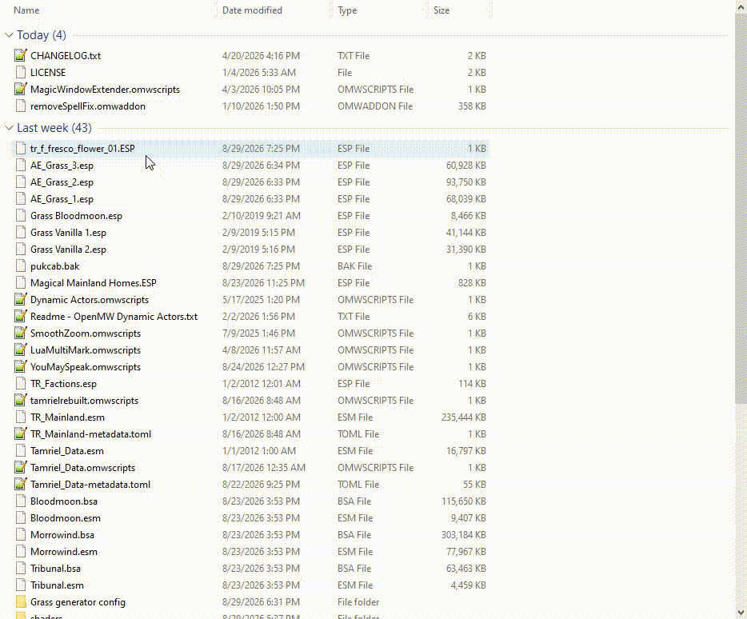

# ESP Isolator

Reads the statics from a ESP file and packages the ESP, meshes, and textures into a single zip. I use this for submitting files to the Tamriel Rebuilt website.




# Installation

On Windows, download and install the msi file from the [releases](https://github.com/nicholas477/esp-isolator/releases) page.

# How to use

On Windows, right click your ESP file and select "Run esp-isolator". A zip file will be produced with the same name as the esp file, in the same directory.

There's also a command line interface:

# Command line options

```
Usage: esp-isolator.exe [OPTIONS] <FILE>

Arguments:
  <FILE>  ESP file to isolate meshes and textures from

Options:
  -o, --output <OUTPUT>  (Optional) Output file path. If not specified, the zip file will be created in the same directory as the input ESP file
  -h, --help             Print help
  -V, --version          Print version
```
